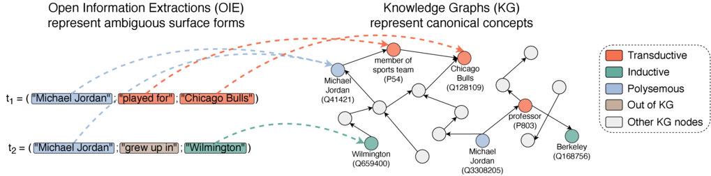

# Linking Surface Facts to Large-Scale Knowledge Graphs

This repository contains the code & data of the paper [Linking Surface Facts to Large-Scale Knowledge Graphs](https://arxiv.org/abs/2310.14909), published at EMNLP 2023.



## Dependencies

Using [miniconda](https://docs.conda.io/projects/miniconda/en/latest/), the virtual environment including all dependencies should be easily reproduced as `conda env create -f environment.yml`.

## Model Zoo

The models that will be released soon are:

| Model | Dataset | Download |
| :--- | :--- | :--- |
| OIE pre-ranker | REBEL | [Link](#) |
| OIE pre-ranker + Context | REBEL | [Link](#) |
| OIE-Fact re-ranker | REBEL | [Link](#) |
| OIE pre-ranker | SynthIE | [Link](#) |

note that we are currently waiting for an approval of our legal team before the release.

## Downloading and preparing the data

In order to be able to run experiments - train new models, or peform inference with existing ones - the data has to be either downloaded or re-created.

### Wikidata Dump

Downloading and processing Wikidata takes a while, and for that reason we release a `.json` file dump of Wikidata. After cloning the repository, you can obtain the processed version of Wikidata inside the `data/wikidata` directory as:

```shell
conda install -c conda-forge git-lfs
git lfs install
git lfs pull
```

### Benchmark Datasets

The datasets are released with the same license as this repository. You can find our data [here](https://huggingface.co/datasets/gorjanradevski/oie-knowledge-graph-linking).

### Wikidata Knowledge Graph embeddings

The Wikidata Knowledge Graph embeddings are needed for inference, and will be released with the models.

## Inference

Assuming the virutal environment is activated (`conda activate kg-grounding`), the models are downloaded (e.g., the OIE pre-ranker trained on REBEL, and the OIE-Fact re-ranker) in the `experiments/` directory, the datasets are either (re-)created or downloaded, and Wikidata is downloaded, inference can be run as:

```python
python src/inference-slot-linking.py --slot_linking_experiment_path "experiments/preranker-rebel-context/" --fact_reranking_experiment_path "experiments/reranker-rebel/" --reranker_k 2 --opts DEVICE "cuda:0" BATCH_SIZE 128 NUM_WORKERS 8 TEST_DATASET_PATH "data/datasets/val_inductive.json" INDEX_PATH "experiments/preranker-rebel-context/kg-index"
```
where `INDEX_PATH` indicates whether we perform OIE linking on a *benchmark-restricted-KG-index* (`kg-index`), or *large-scale-KG-index* (`full-kg-index`).

## Training

Training new models also assumes that the environment is activated, and that the datasets and Wikidata are downloaded. Then, you can train (e.g., an OIE pre-ranker) model as:

```python
python src/train-slot-linking.py --config_path "configs/preranker.yaml"
```

In order to modify any of the `config.yaml` values provide `--opts ...` after the `config_path` as: `--opts BATCH_SIZE 128 NUM_WORKERS 12 ...`.
 
## License

Please see the license file.

## Citation

If you use our work or resources for your research, please cite the following paper:

```tex
@article{radevski2023linking,
  title={Linking surface facts to large-scale knowledge graphs},
  author={Radevski, Gorjan and Gashteovski, Kiril and Hung, Chia-Chien and Lawrence, Carolin and Glava{\v{s}}, Goran},
  journal={arXiv preprint arXiv:2310.14909},
  year={2023}
}
```